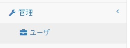
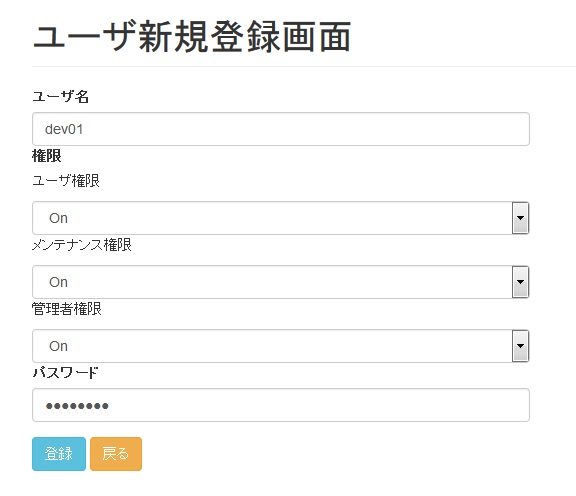
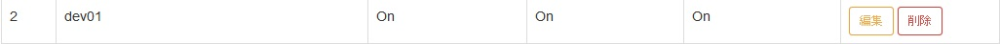
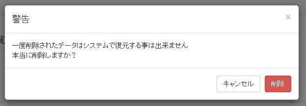
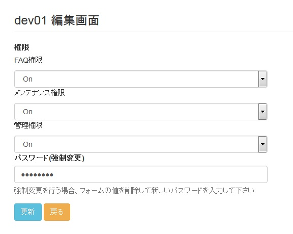

[(トップへ戻る)](https://github.com/solctatg/FAQService_Manual)
# アカウント登録/削除/権限変更
## 登録
- メニューから「ユーザ」をクリックして下さい

------------------------------------

- 「ユーザ一覧」下にある「新規登録」をクリックします

------------------------------------

- 登録画面が表示されますので、「ユーザ名」、「ユーザ権限」、「メンテナンス権限」、「管理者権限」、「パスワード」を入力して「登録」ボタンをクリックして下さい

|権限|権限内容|
|:--|:-------|
|ユーザ権限|メニュー「FAQ」にアクセス出来る権限です。「OFF」の場合、メニューに「FAQ」が表示されません|
|メンテナンス権限|メニュー「メンテナンス」にアクセス出来る権限です。「OFF」の場合、メニューに「メンテナンス」が表示されません|
|管理者権限|メニュー「管理」にアクセスできる権限です。「OFF」の場合、メニューに「管理」が画面に表示されません|

------------------------------------

- 正常に登録が完了するとボタン下に「success」と表示されます

------------------------------------

## 削除
- メニューから「ユーザ」をクリックして下さい

------------------------------------

- 削除を行いたいユーザを表からさがし、「削除」ボタンをクリックします

------------------------------------

- 最終確認用ポップアップが表示されますので、問題が無ければ「削除」ボタンをクリックします

------------------------------------

- 正常に削除が完了すると「削除」ページに自動的に遷移されます、削除したユーザが画面上に表示されていないことを確認してください

## 編集
- メニューから「ユーザ」をクリックして下さい

------------------------------------

- 編集を行いたいユーザを表からさがし、「編集」ボタンをクリックします

------------------------------------

- 編集画面にて、権限の変更またはパスワード変更が可能です。編集が完了したら「更新」ボタンをクリックします

------------------------------------

- 更新が正しく完了するとボタン下に「Success」と表示されます

------------------------------------

[(トップへ戻る)](https://github.com/solctatg/FAQService_Manual)