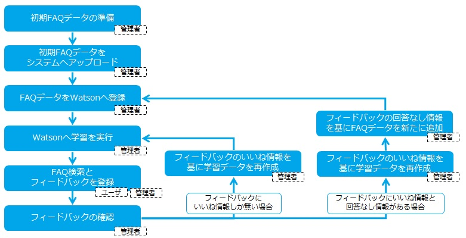

[(トップへ戻る)](https://github.com/solctatg/FAQService_Manual)
# 利用フロー
- 本サービスを利用する際の基本フローは以下の通りとなっております

------------------------------------

------------------------------------

|項目|補足|
|:----|:----|
|[初期FAQデータの準備](/advance/data.md)|FAQデータを纏めたCSVファイルを準備します|
|[初期FAQデータをシステムへアップロード](/maintenance/initial.md)|準備したCSVファイルをシステムへアップロードします|
|[FAQデータをWatsonへ登録](/maintenance/faqRegist.md)|システムにアップロードしたFAQデータをWatsonへ登録します|
|[Watsonへ学習を実行](/maintenance/faqLearning.md)|登録されたデータを基にWatsonへ学習を実行させます|
|[FAQ検索とフィードバックを登録](/basic/faq.md)|FAQ検索を行い、回答結果を基にフィードバックを登録します|
|[フィードバックの確認](/maintenance/feedback.md#確認)|ユーザが登録したフィードバック情報を確認|
|[フィードバックのいいね情報を基に学習データを作成](/maintenance/feedback.md#データ有効化と質問文の編集--いいね情報-)|いいね情報として登録されたユーザの質問と回答データに対して、関連度を登録し 再学習データとして有効化する|
|[フィードバックの回答なし情報を基にFAQデータを新たに追加](/maintenance/feedback.md#回答無しデータを基に新規faqデータを追加する--回答無し情報-)|回答無し情報として登録されユーザの質問に対して、回答を登録し 新しいQAデータとして利用する|

[(トップへ戻る)](https://github.com/solctatg/FAQService_Manual)