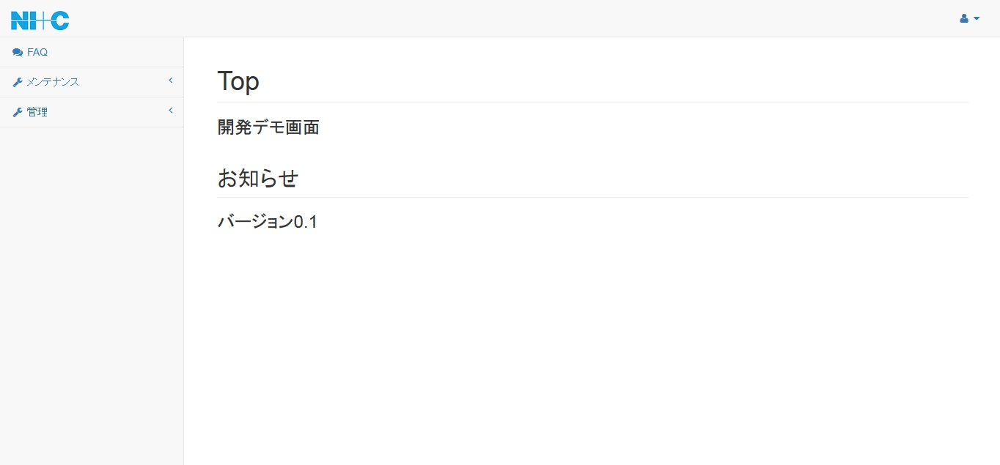
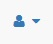
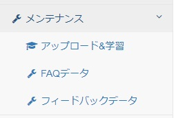
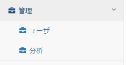
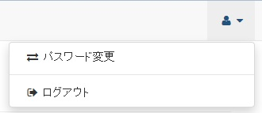

[(トップへ戻る)](../)
# 画面説明
## メニュー説明

|メニュー|補足|
|:----|:----|
|メインメニュー||
|FAQ|FAQ検索ページにアクセスするためのメニュー|
|メンテナンス|メンテナンス系ページにアクセスするためのメニュー|
|管理|管理系ページにアクセスするためのメニュー|
|サブメニュー||
||ログアウト・パスワード変更ページにアクセスするためのページ|

------------------------------------

### メインメニュー(メンテナンス)

|メニュー|補足|
|:----|:----|
|アップロード＆学習|「初期FAQデータアップロード」、「WatsonへFAQデータを登録」 「Watsonへ学習開始依頼」、「Watson Status」を行うページ|
|FAQデータ|QAデータの登録、削除、編集、エクスポート、インポートを行うページ|
|フィードバックデータ|ユーザのFAQ検索時に登録されたフィードバック情報を確認、編集、登録 削除、エクスポート、インポートを行うページ|

------------------------------------

### メインメニュー(管理)

|メニュー|補足|
|:----|:----|
|ユーザ|ログインユーザの登録、削除、編集を行うページ|
|分析|月毎の検索数、フィードバック(いいねと回答なし)数の表示を行うページ|

------------------------------------

### サブメニュー

|メニュー|補足|
|:----|:----|
|パスワード変更|ログインパスワードの変更を行うページ|
|ログアウト|ログアウト|

[(トップへ戻る)](../)