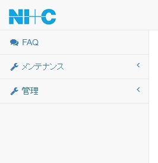
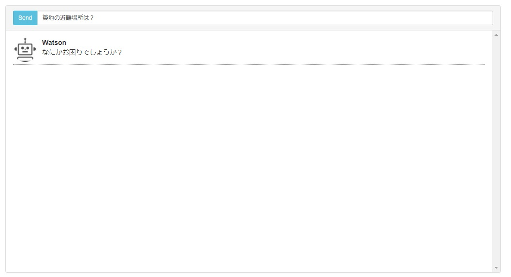
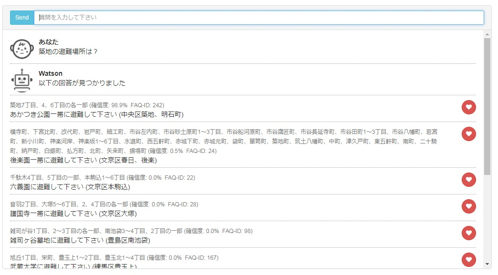
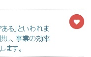
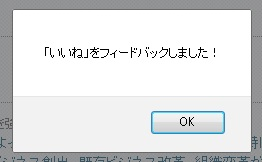
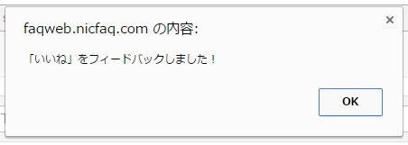
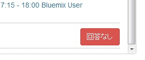
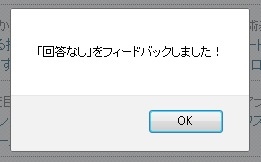
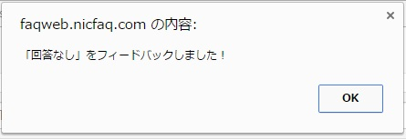

[(トップへ戻る)](../)
# FAQ検索
## 検索
- メニューから「FAQ」をクリックして下さい

------------------------------------

- FAQの検索画面が表示されたら、検索ボックスに質問内容を入力し、「Enter」キーを押下するか「Send」ボタンをクリックしてください

------------------------------------

- 入力された質問からWatsonが回答候補を表示します

------------------------------------

## フィードバック

- 入力した質問からWatsonが回答候補を表示します、もし質問に一致する回答があれば回答横に表示された「いいね」ボタンをクリックします

------------------------------------

- 「いいね」情報が正常に登録されると、登録が完了したポップアップが表示されます

------------------------------------
> - Firefoxの場合  
>   
> - Chromeの場合  
> 

- もし質問に一致する回答が無ければ回答候補の一番したに表示されている「回答無し」ボタンをクリックします

- 「回答なし」情報が正常に登録されると、登録が完了したポップアップが表示されます

------------------------------------
> - Firefoxの場合  
>   
> - Chromeの場合  
> 

[(トップへ戻る)](../)