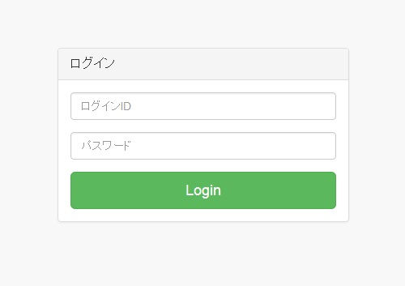
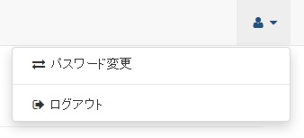

[(トップへ戻る)](../)
# ログイン
- ブラウザからFAQサービスのURLにアクセスすると、ログインページが表示されます  
``※URLについてはNI+Cよりご連絡したURLにアクセスお願い致します``

------------------------------------

- ログインIDとパスワードを入力し、「Login」ボタンをクリックして下さい

------------------------------------

- 正常にログインが完了するとTop画面が表示されます

# ログアウト
- FAQサービスの右上にあるアイコンをクリックして下さい

------------------------------------

- メニューから「ログアウト」をクリックして下さい

- 正常にログアウトされるとログイン画面が表示されます

[(トップへ戻る)](../)