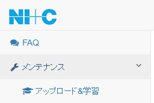
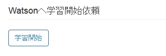
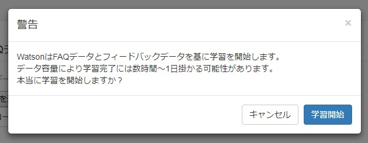
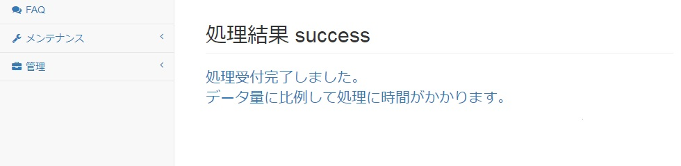
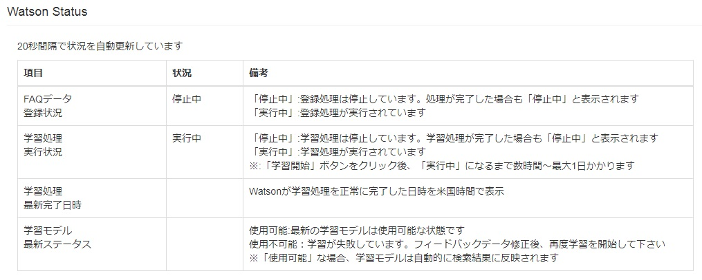
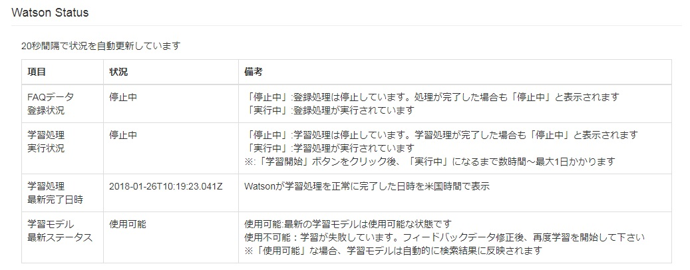

[(トップへ戻る)](../)
# Watsonへ学習開始依頼
- メニューから「アップロード&学習」をクリックして下さい

------------------------------------

- 「Watsonへ学習開始依頼」下に表示された「学習開始」ボタンをクリックします

------------------------------------

- 最終確認用のポップアップが表示されますので、問題が無ければ「学習開始」ボタンをクリックします

------------------------------------

- 処理が正常に開始されると、画面上に「処理結果 success」と表示されます

------------------------------------

- しばらくすると、「アップロード&学習」ページの「Watson Status」の「学習処理実行状況」が「実行中」に変わります。 ※備考にも記載してありますが、状況が「実行中」になるまで数時間～最大1日かかる可能性があります。Watsonへの学習については、スケジュールに余裕を持って実行して下さい。

------------------------------------

- 学習が完了すると、「学習処理最新完了日時」に完了日時、「学習モデル最新ステータス」に使用可能と表示されます。この結果が表示された場合、学習が正常に完了しております。

------------------------------------

[(トップへ戻る)](../)