[(トップへ戻る)](https://github.com/solctatg/FAQService_Manual)
# QAデータの登録/削除/編集/エクスポート/インポート
## 登録
- メニューから「FAQデータ」をクリックして下さい

------------------------------------
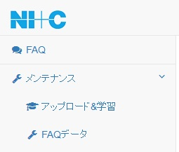

- 「FAQデータ」下に表示された「新規登録」ボタンをクリックして下さい

------------------------------------
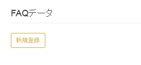

- QAデータ登録用の画面が表示されますので、登録したいQAデータをテキストフォームに入力して「新規登録」ボタンをクリックして下さい

------------------------------------
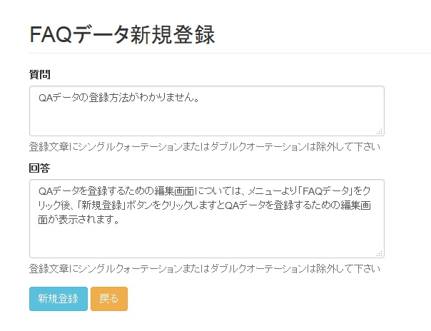

- 正常に登録が完了すると「New FAQ data registration success」と表示されます。「戻る」ボタンをクリックして、「FAQデータ」ページに戻ると表に登録したデータが表示されます

------------------------------------
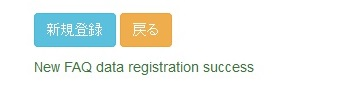

------------------------------------
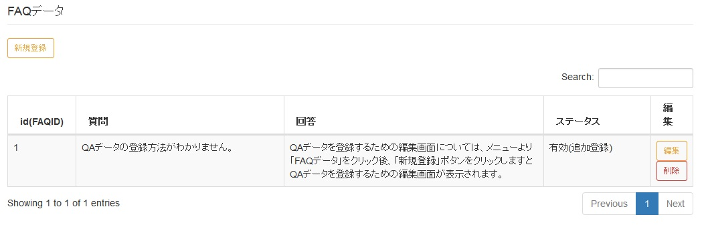

## 削除
- メニューから「FAQデータ」をクリックして下さい

------------------------------------

- 削除したいQAデータをページ下部に表示された表から探し、「削除」ボタンをクリックして下さい

------------------------------------
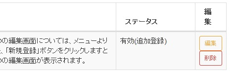

- 最終確認用ポップアップが表示されますので、問題が無ければ「削除」ボタンをクリックして下さい

------------------------------------
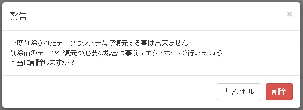

- 正常に削除が完了すると「FAQデータ」ページに自動的に遷移されます、削除したデータが画面上に表示されていないことを確認してください

## 編集
- メニューから「FAQデータ」をクリックして下さい

------------------------------------

- 編集したいQAデータをページ下部に表示された表から探し、「編集」ボタンをクリックして下さい

------------------------------------

- 編集画面が表示されますので、データの編集を行い「更新」ボタンをクリックして下さい

------------------------------------
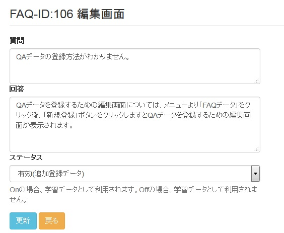

- 正常に編集が完了すると「Success update」と表示されます

------------------------------------

## エクスポート
- メニューから「FAQデータ」をクリックして下さい

------------------------------------

- 管理下にある「Export」タブから「Export」ボタンをクリックして下さい

------------------------------------
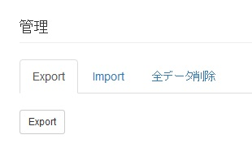

- エキスポートが実施され「export-faq_doc-yyyy-mm-dd-hhmmss.csv」というファイルが出力される

------------------------------------
> - Chromeの場合  
>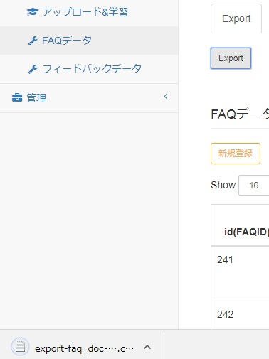  
> - Firefoxの場合  
>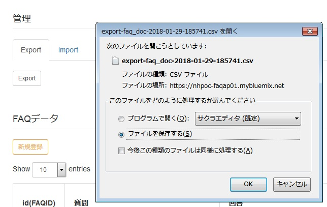

## インポート
- メニューから「FAQデータ」をクリックして下さい

------------------------------------

- 管理下にある「Import」タブから、「ファイルを開く(chrome)」または「参照(firefox)」ボタンをクリックして下さい

------------------------------------
> - Chromeの場合  
>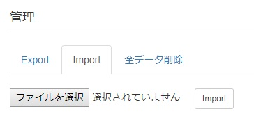  
> - Firefoxの場合  
>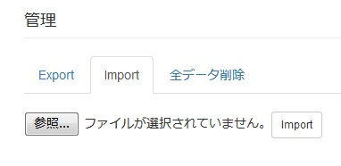

- インポートするファイルを選択し、「開く」ボタンをクリックして下さい

------------------------------------
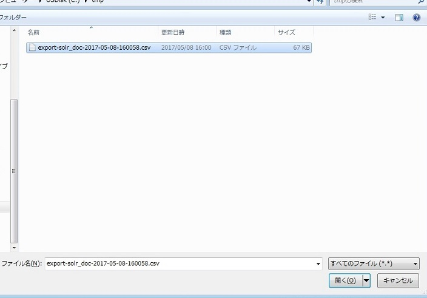

- インポートするファイルを選択したら、「インポート」ボタンをクリックて下さい

------------------------------------
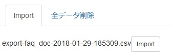

- インポート処理が正常に開始されると、「success」と表示されます。
*インポートするデータ量によってインポート処理の時間が変動しますのでご注意下さい*

------------------------------------
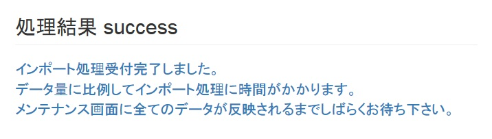

- インポート処理が完了すると、「FAQデータ」ページにインポートしたデータが表示されます

[(トップへ戻る)](https://github.com/solctatg/FAQService_Manual)
