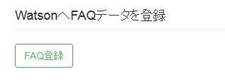
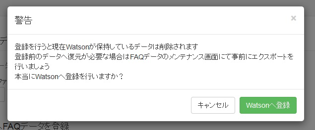
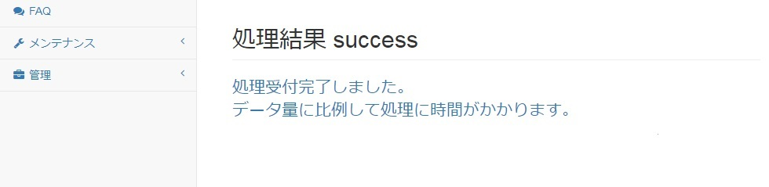
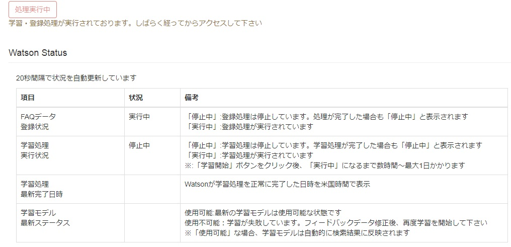
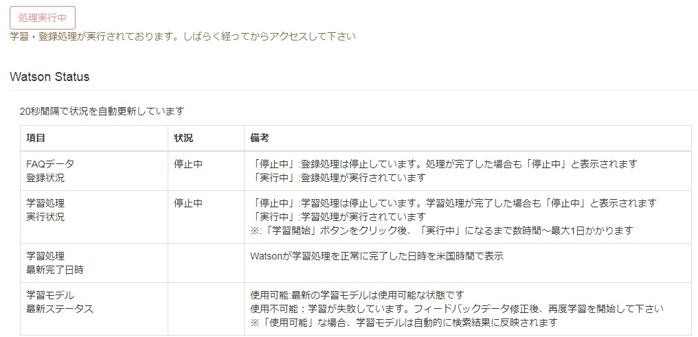
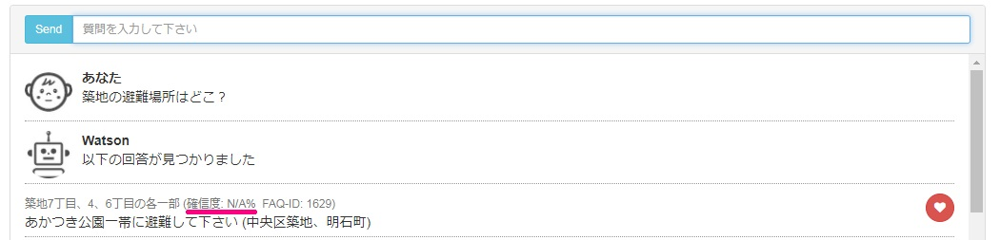

[(トップへ戻る)](../)
# FAQデータをWatsonへ登録方法
- メニューから「アップロード&学習」をクリックして下さい

------------------------------------

- 「WatsonへFAQデータを登録」下に表示された「FAQ登録」ボタンをクリックします

------------------------------------

- 最終確認用のポップアップが表示されますので、問題が無ければ「Watsonへ登録」ボタンをクリックします

------------------------------------

- 処理が正常に開始されると、画面上に「処理結果 success」と表示されます。Watsonへの登録状況については「アップロード&学習」画面で確認が行なえます。

------------------------------------

- 「アップロード&学習」画面にある「Watson Status」の「FAQデータ登録状況」で実行状態の確認が行なえます。WatsonへFAQデータの登録が行われていると状況が「実行中」となります。

------------------------------------

- しばらくすると、「FAQデータ登録状況」が「停止中」に変わります。停止中に変わった場合、Watsonへの登録は完了です。

------------------------------------

- 本作業を実施すると「FAQ」ページにて検索が開始出来ます。ただし、検索結果上に表示される確信度は表示されません(N/Aと表示)。
  確信度はフィードバックデータをWatsonへ学習することで初めて表示されますのでご留意下さい。

------------------------------------

[(トップへ戻る)](../)