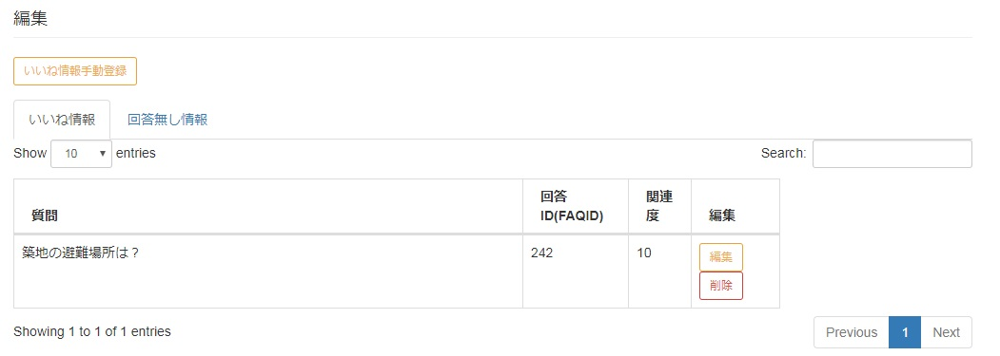

[(トップへ戻る)](../)
# フィードバックデータの確認/編集/登録/削除/エクスポート/インポート
## 確認
- メニューから「フィードバックデータ」をクリックして下さい

------------------------------------

- 「編集」下にユーザのフィードバック情報である「いいね」・「回答無し」情報が表示されます。

------------------------------------
>- いいね  
>  
>- 回答無し  
>

## 編集 -いいね情報-
#### データ有効化と質問文の編集 -いいね情報-
フィードバックページに表示された「いいね情報」をWatsonの学習データとして利用するには、データの有効化を行います。また、表示される質問文はユーザが実際入力した質問文になります、必要に応じて編集を行うことが可能です

- メニューから「フィードバックデータ」をクリックして下さい

------------------------------------

- 「編集」下にユーザのフィードバック情報である「いいね」情報が表示されます。データが有効化されていない場合は、関連度の列に何も表示されません。実際にデータの編集を行うには、編集列にある「編集」ボタンをクリックして下さい

------------------------------------

- 「編集」ボタンクリック後、いいね情報編集画面に遷移します。必要に応じて質問文の編集が可能です。また、「更新」ボタンをクリックすると自動的に次回の学習データとして、有効化されます。
    - 質問：ユーザが検索した質問文(編集可能)
    - 回答ID：ユーザが検索した質問文に対して、ユーザが答えだと思った回答情報(編集不可)
    - 関連度：質問文と回答情報がどれぐらい関連しているか設定(Watson APIの仕様により10固定)

------------------------------------

- 「更新」ボタンをクリック後、フィードバックデータページに遷移します。先程、関連度列には何も表示されていない状態でしたが、データが有効化されたことにより、関連度列に「10」と表示されるようになりました。この状態は、現在データが有効化され、次回Watsonの学習データとして利用されることを意味しております
- ※有効化を行ったデータをWatsonに学習させたい場合は、後続作業として[Watsonへ学習を実行](/maintenance/faqLearning.md)を実施して下さい

------------------------------------

#### 削除 -いいね情報-
- メニューから「フィードバックデータ」をクリックして下さい

------------------------------------

- 「編集」下にユーザのフィードバック情報である「いいね」情報が表示されます。編集列にある「削除」ボタンをクリックして下さい

------------------------------------

- 「削除」ボタンをクリックすると、警告画面が表示されます。問題がなければ、「削除」ボタンをクリックして下さい

------------------------------------

- 正常に削除が完了すると、フィードバックデータページに遷移し、先程削除したデータが消えています

------------------------------------

## 編集 -回答無し情報-
### 回答無しデータを基に新規FAQデータを追加する -回答無し情報-
- メニューから「フィードバックデータ」をクリックして下さい

------------------------------------

- 「編集」下にある「回答なし情報」タブをクリックすると、ユーザが回答が無かったとフィードバックした質問文が表示されます。このフィードバックを基に新しいFAQデータを作成します。編集列に表示された「編集」ボタンをクリックして下さい

------------------------------------

- 「編集」ボタンクリック後、「回答登録画面」に遷移します。
    - 質問：ユーザが検索した質問文(編集可能)
    - 回答：ユーザが検索した質問文に対して、適切な回答情報を入力する
    - URL：必要に応じて、回答を補足するURLを入力する(オプション)

------------------------------------

- ユーザからフィードバックされた質問文に対して適切な回答情報を入力し、「追加」ボタンをクリックします。

------------------------------------

- 正常に削除が完了すると、フィードバックデータページに遷移し、回答無し情報のテーブルからデータが削除され、FAQデータページに最新データとして追加されます
- ※「追加」ボタンをクリックしただけでは、Watsonには登録されません。FAQ検索でヒットするために後続作業として[WatsonへFAQデータの登録](/maintenance/faqRegist.md)を実施して下さい

------------------------------------

------------------------------------

### 削除 -回答無し情報-
- メニューから「フィードバックデータ」をクリックして下さい

------------------------------------

- 「編集」下にある「回答なし情報」タブをクリックすると、ユーザが回答が無かったとフィードバックした質問文が表示されます。編集列にある「削除」ボタンをクリックして下さい

------------------------------------

- 「削除」ボタンをクリックすると、警告画面が表示されます。問題がなければ、「削除」ボタンをクリックして下さい

------------------------------------

- 正常に削除が完了すると、フィードバックデータページに遷移し、先程削除したデータが消えています

------------------------------------

## 登録
ユーザのいいね情報をWatsonに学習させることで、検索結果のランキングが変動します。本システムは、事前に問合せが予想される質問文に対して、指定した回答結果が上位に表示されるようにいいね情報を担当者が手動で登録する事が可能となっています。

- メニューから「フィードバックデータ」をクリックして下さい

------------------------------------

- 「編集」下にある「いいね情報手動登録」ボタンをクリックします

-------------------------------------

- 「いいね情報手動登録」ページに遷移します
    - 質問：事前に問合せが予想される質問文を入力する欄
    - 回答ID(FAQ-ID)：質問文に対して適切な回答となるIDを指定します。IDは「FAQデータ」ページに表示されたテーブルのid列の値を指定します
    - 関連度：質問文と回答情報がどれぐらい関連しているか設定(Watson APIの仕様により10固定)

-------------------------------------

- 質問文と回答IDの入力が完了したら、「手動登録」ボタンをクリックして下さい

-------------------------------------

- 正常に登録が完了すると、ボタン配下に「New data registration success」と表示されます

-------------------------------------

## エキスポート
- メニューから「フィードバックデータ」をクリックして下さい

------------------------------------

- 管理下にある「Export」タブから「Export」ボタンをクリックして下さい

------------------------------------

- エキスポートが実施され「export-fb_doc-yyyy-mm-dd-hhmmss.csv」というファイルが出力される

------------------------------------
> - Chromeの場合  
>  
> - Firefoxの場合  
>

## インポート
- メニューから「フィードバックデータ」をクリックして下さい

------------------------------------

- 管理下にある「Import」タブから、「ファイルを開く(chrome)」または「参照(firefox)」ボタンをクリックして下さい

------------------------------------
> - Chromeの場合  
>
> - Firefoxの場合  
>

- インポートするファイルを選択し、「開く」ボタンをクリックして下さい

------------------------------------

- インポートするファイルを選択したら、「インポート」ボタンをクリックて下さい

------------------------------------

- インポート処理が正常に開始されると、「success」と表示されます。
*インポートするデータ量によってインポート処理の時間が変動しますのでご注意下さい*

------------------------------------

- インポート処理が完了すると、「FAQデータ」ページにインポートしたデータが表示されます

[(トップへ戻る)](../)