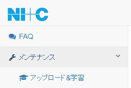
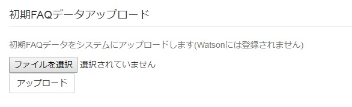
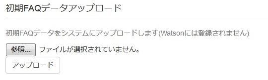
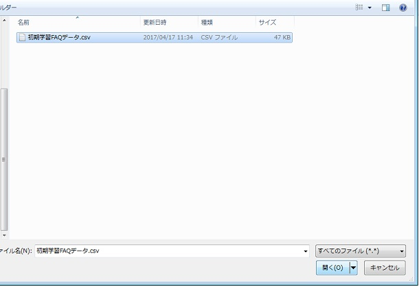
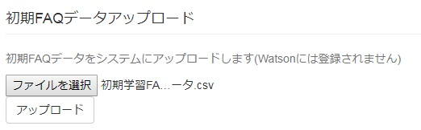
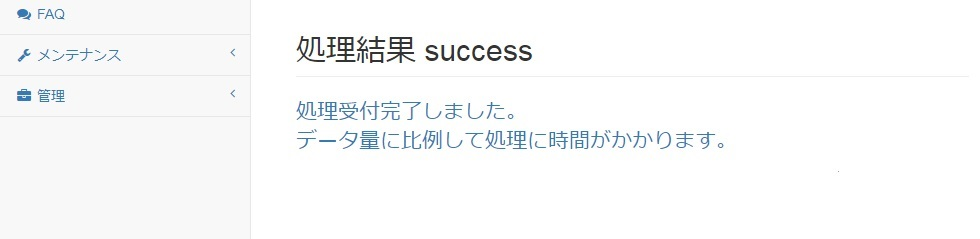
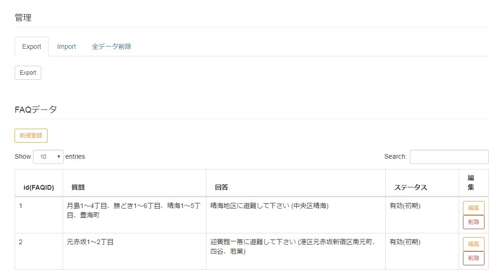

[(トップへ戻る)](https://github.com/solctatg/FAQService_Manual)
# 初期QAデータのアップロード方法
- メニューから「アップロード&学習」をクリックして下さい

------------------------------------


- 「初期FAQデータアップロード」下に表示された「ファイルを選択(chrome)」または「参照(firerfox)」ボタンをクリックします

------------------------------------
> - Chromeの場合  
>
> - Firefoxの場合  
>

- ファイル選択用のポップアップが表示されますので、初期学習用のFAQデータを選択して下さい

------------------------------------


- 初期学習データを選択したら、「アップロード」ボタンをクリックして下さい

------------------------------------


- 登録処理が正常に開始されると、画面上に「処理結果 success」と表示されます

------------------------------------


- 初期学習用のFAQデータがシステムへ正常に登録されると、メンテナンスページ「FAQデータ」にてデータの一覧が表示されます

------------------------------------


**注意事項**
```
本手順だけではFAQ検索は行なえません、後続の作業として「WatsonへFAQデータの登録」の実施が必要です

```

[(トップへ戻る)](https://github.com/solctatg/FAQService_Manual)